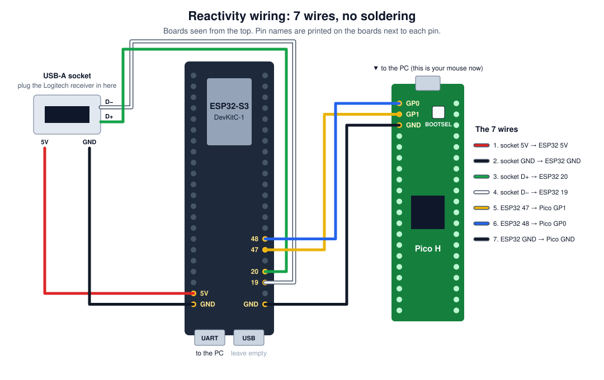
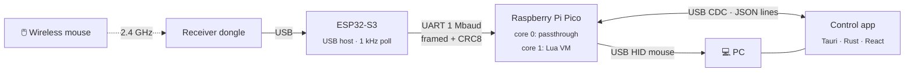

<div align="center">

# Reactivity

**A programmable hardware layer between your mouse and your PC.**

A wireless mouse goes in and a standard USB mouse comes out. In between you can watch the
events, remap buttons, inject movement and clicks, and run Lua scripts on the device.


[Setup](#setup-no-coding-needed) · [Features](#features) · [How it works](#how-it-works) ·
[Scripting](#on-board-scripting) · [Build from source](#build-from-source) · [Roadmap](#status--roadmap)

</div>

---

## Overview

Reactivity has two boards. An **ESP32-S3** acts as a USB host for the mouse's wireless
receiver: it reads the receiver's HID reports and forwards them over UART at 1 kHz. A
**Raspberry Pi Pico** presents itself to the PC as an ordinary wired USB mouse and passes
those reports through. The Pico also opens a serial channel, which a desktop control app
uses to inspect, inject, remap and script input.

The PC needs no drivers. It sees a normal mouse.

> [!NOTE]
> Reactivity is meant for input remapping, accessibility and automation. Using it to get an
> advantage in online games breaks those games' terms of service, and it is not a supported
> use.

## Setup (no coding needed)

Four steps: **buy** the parts, **connect** 7 wires, **flash** 2 files, **install** the app.
You don't need to solder, write code, or install any developer tools.

### Step 1 · Buy the parts

| ✔ | Part | Rough price | Search on Amazon |
|:-:|---|---|---|
| ☐ | **ESP32-S3-DevKitC-1, N32R16V version**<br><sub>Get exactly *N32R16V*. The firmware is built for that memory chip, so other versions won't boot.</sub> | $15 | [ESP32-S3-DevKitC-1 N32R16V](https://www.amazon.com/s?k=ESP32-S3-DevKitC-1+N32R16V) |
| ☐ | **Raspberry Pi Pico H**<br><sub>The **H** comes with the pins already attached. A plain "Pico" needs soldering.</sub> | $5 | [Raspberry Pi Pico H](https://www.amazon.com/s?k=Raspberry+Pi+Pico+H) |
| ☐ | **USB-A female to Dupont cable** (4 wires)<br><sub>A USB socket with 4 loose wires that push onto pins. The receiver plugs in here.</sub> | $6 | [USB A female to dupont 4 pin cable](https://www.amazon.com/s?k=USB+A+female+to+dupont+4+pin+cable) |
| ☐ | **Female-to-female jumper wires**<br><sub>You need 3. Packs come with dozens.</sub> | $6 | [female to female jumper wires](https://www.amazon.com/s?k=female+to+female+dupont+jumper+wires) |
| ☐ | **Micro-USB cable** for the Pico<br><sub>It has to be a *data* cable. Many cheap cables only charge.</sub> | $5 | [micro USB data cable](https://www.amazon.com/s?k=micro+usb+data+cable) |
| ☐ | **USB cable for the ESP32** (usually USB-C)<br><sub>Check which plug your board has.</sub> | $5 | [USB C data cable](https://www.amazon.com/s?k=usb+c+data+cable) |
| ☐ | **A Logitech Lightspeed wireless mouse** with its USB receiver<br><sub>Tested with the G Pro X Superlight. Other mice may not work yet.</sub> | (you have it) | |

### Step 2 · Connect the wires

Unplug everything first. Then push on the 7 wires below. The pin names (`5V`, `GND`, `19`,
`20`, `47`, `48`) are printed on the ESP32 next to each pin. On the Pico, **GP0, GP1 and GND
are the first 3 pins on the left, right next to the USB plug**.

<p align="center"></p>

| # | From | To | Wire |
|:-:|---|---|---|
| 1 | USB socket **5V** (red, may say VCC) | ESP32 **5V** | 🟥 |
| 2 | USB socket **GND** (black) | ESP32 **GND** (any GND pin) | ⬛ |
| 3 | USB socket **D+** (green) | ESP32 **20** | 🟩 |
| 4 | USB socket **D−** (white) | ESP32 **19** | ⬜ |
| 5 | ESP32 **47** | Pico **GP1** (2nd pin) | 🟨 |
| 6 | ESP32 **48** | Pico **GP0** (1st pin, the corner) | 🟦 |
| 7 | ESP32 **GND** | Pico **GND** (3rd pin) | ⬛ |

Then plug the **Logitech receiver** into the USB socket.

> [!TIP]
> Mixing up 19 and 20 (D− and D+) is the most common mistake. If nothing works later, swap
> those two wires first. Swapping them can't damage anything.

### Step 3 · Flash the firmware

Go to the **[latest release](https://github.com/opsec-bot/Reactivity/releases/latest)** and
download the two firmware files: `Reactivity-Pico-….uf2` and `Reactivity-ESP32-….bin`.

**Pico** (takes about 10 seconds):

1. Hold down the white **BOOTSEL** button on the Pico.
2. While holding it, plug the Pico into your PC. Then let go.
3. A drive called **RPI-RP2** opens, like a USB stick.
4. Drag `Reactivity-Pico-….uf2` onto it. The drive closes by itself, which means it worked.

**ESP32** (takes about 1 minute, in Chrome or Edge):

1. Plug the ESP32 into your PC through the port labeled **UART**. If there are two ports,
   leave the one labeled **USB** empty.
2. Open **<https://espressif.github.io/esptool-js/>**.
3. Click **Connect** and pick the port that says **CP210x** or **USB to UART**.
4. Change **Flash Address** to `0x0`. It starts out as `0x1000`, and flashing there won't boot.
5. Choose `Reactivity-ESP32-….bin` and click **Program**.
6. When it says it's done, press the **RST** button on the ESP32.

<details>
<summary>ESP32 won't connect?</summary>

- Hold **BOOT**, tap **RST**, let go of **BOOT**, then click **Connect** again.
- No port shows up: install the [CP210x driver](https://www.silabs.com/developers/usb-to-uart-bridge-vcp-drivers)
  (some clone boards use a CH343 chip instead, so search for "CH343 driver"), and try another cable.

</details>

### Step 4 · Use it

1. Keep **both** boards plugged into the PC: the Pico is the mouse your PC sees, and the
   ESP32 needs the power. Any phone charger works for the ESP32 too.
2. Turn on the mouse and move it. The cursor should move.
3. From the [latest release](https://github.com/opsec-bot/Reactivity/releases/latest),
   download **`Reactivity-Control-…-setup.exe`** and install it. If Windows says
   *"Windows protected your PC"*, click **More info → Run anyway**. The app isn't
   code-signed yet.
4. Open the app, choose the Pico's port (it's marked automatically) and click **Connect**.

| Tab | What it does |
|---|---|
| **Control** | Send moves, clicks and scrolls |
| **Watch** | Live view of what your mouse is doing |
| **Remap** | Change what a button does |
| **Scripts** | Write, run and save Lua scripts on the board |
| **Console** | Raw serial traffic |

Updating later: download the new files from the latest release and repeat Step 3.

## Features

| | |
|---|---|
| 🖱️ **Transparent passthrough** | 1 kHz polling end to end, with a coalescing queue that never drops motion or button edges |
| 🎛️ **Control app** | Desktop app (Tauri + React): live status, event watcher, move/click/scroll injection, remaps |
| 📜 **On-board Lua** | Scripts run on the Pico's second core, keep running with the app closed, and can start automatically at power-up |
| 🔁 **G Hub-compatible API** | `OnEvent`, `MoveMouseRelative`, `PressMouseButton`, `Sleep`, … most mouse scripts written for G Hub paste straight in |
| ⚡ **One-click flashing** | Detects the boards, then builds, flashes and verifies both, from the CLI or the app's Firmware tab |
| 🧯 **Safe by design** | Scripts are sandboxed (memory cap, no I/O), stop instantly, and release any buttons they held |

## How it works



The Pico splits its work across its two cores:

- **Core 0** runs the hot path (UART → queue → USB) and the command channel. Nothing slow
  runs ahead of the hot path: formatting, logging and status output all happen after it.
- **Core 1** runs the Lua VM. It receives button events and sends back actions and log lines
  through lock-free queues, so a slow or broken script can't hold up passthrough.

Physical and injected input are **merged**, not interleaved: buttons are OR'd together and
motion is summed. An injected click therefore never releases a button you're holding.

## Build from source

This section is for development. Everyday use only needs the [Setup](#setup-no-coding-needed)
steps above. Full pin tables and header positions are in [`docs/PINOUT.md`](docs/PINOUT.md).

### Prerequisites

- [`arduino-cli`](https://arduino.github.io/arduino-cli/) with the `esp32:esp32@3.0.0` and `rp2040:rp2040@5.6.0` cores
- Python 3.10+ with `pyserial`
- Node.js + [pnpm](https://pnpm.io/), and a Rust toolchain (for the control app)

### 1 · Flash the boards

Plug in the ESP32's **UART** port (the CP210x one) and the Pico, then run:

```powershell
python scripts/flash.py              # detect, build and flash everything that's plugged in
```

<details>
<summary>More flash options</summary>

```powershell
python scripts/flash.py --check      # only show what is detected
python scripts/flash.py --only pico  # just one board (esp32 | pico)
python scripts/flash.py --build-only # compile both, touch no hardware
python scripts/flash.py --json       # machine-readable events (used by the app)
python scripts/test_flash.py         # offline tests for detection/selection
```

- A Pico already running this firmware reboots into its bootloader by itself. Only a blank
  Pico needs **BOOTSEL** held while you plug it in.
- Close any serial monitor first, because an open COM port can't be flashed.
- Failures print a specific hint: busy port, ESP32 not in download mode, Pico not in
  BOOTSEL, or missing core.

</details>

### 2 · Run the control app

```powershell
cd rust-client
pnpm install
pnpm tauri dev
```

A dev build also has a **Firmware** tab, which runs `scripts/flash.py` from this checkout to
build and flash both boards from the GUI.

### Releases

[`.github/workflows/release.yml`](.github/workflows/release.yml) builds the Windows
installer, a portable exe and both firmware files, then publishes them as a GitHub Release.

- **One click:** Actions → **Release** → **Run workflow** → pick `patch`, `minor` or
  `major`. The workflow works out the next version from the latest `vX.Y.Z` tag.
- **Or tag it yourself:** `git tag v1.2.3 && git push origin v1.2.3`.

The workflow takes the version from the tag and writes it into the app at build time, so
version numbers are never bumped by hand. Release notes are generated from the commits
since the previous tag.

## On-board scripting

Scripts are written in **Lua 5.4** and use the same functions as Logitech G Hub. Press
**Run on board** to try a script, or **Save to board** to keep it in flash so it starts at
every power-up.

```lua
-- Hold the back side button to scroll down continuously.
function OnEvent(event, arg)
  if event == "PROFILE_ACTIVATED" then
    SetMouseButtonBlocked(4, true)          -- don't also send "Back" to the browser
  elseif event == "MOUSE_BUTTON_PRESSED" and arg == 4 then
    repeat
      MoveMouseWheel(-1)
      Sleep(40)
    until not IsMouseButtonPressed(4)
  end
end
```

<details>
<summary><b>API reference</b></summary>

| Function | Description |
|---|---|
| `OnEvent(event, arg, family)` | Your handler. Events: `PROFILE_ACTIVATED`, `PROFILE_DEACTIVATED`, `MOUSE_BUTTON_PRESSED`, `MOUSE_BUTTON_RELEASED`. `arg`: 1 left · 2 right · 3 middle · 4 back · 5 forward |
| `MoveMouseRelative(dx, dy)` | Move the cursor |
| `MoveMouseWheel(n)` | Scroll *n* notches (positive = up) |
| `PressMouseButton(n)` / `ReleaseMouseButton(n)` | Hold / release. *n*: 1 left · 2 middle · 3 right · 4 back · 5 forward (G Hub's order) |
| `PressAndReleaseMouseButton(n)` | Single click |
| `IsMouseButtonPressed(n)` | Whether the **physical** button is held |
| `Sleep(ms)` | Wait; events queue up meanwhile |
| `GetRunningTime()` | Milliseconds since the script started |
| `OutputLogMessage(fmt, ...)` · `print(...)` | Write to the app's output pane |
| `ClearLog()` | Clear the output pane |
| `EnablePrimaryMouseButtonEvents(on)` | Also report the left button to `OnEvent` (off by default) |
| `SetMouseButtonBlocked(n, on)` | *Extension:* hide a physical button from the PC while the script runs |

**Not available:** keyboard output (`PressKey`…), absolute positioning (`MoveMouseTo`),
macros and M-keys, because the device only sits on the mouse. `IsModifierPressed` and
`IsKeyLockOn` always return `false`.

</details>

<details>
<summary><b>Sandbox & limits</b></summary>

- 16 KB of script source and 96 KB of Lua heap. Running out of memory raises a normal Lua error.
- Standard libraries: `string`, `table`, `math`, `coroutine`, `utf8`. No `io`, `os`, `package` or `debug`.
- Stop takes effect right away, even for `while true do end` or a loop wrapped in `pcall`.
- A script that stops or errors always releases any buttons it held.
- A runtime error inside `OnEvent` is logged and the script keeps running, as in G Hub.
- Saving writes to the Pico's 64 KB LittleFS partition, which briefly pauses passthrough.

</details>

## Protocol

The app and the Pico exchange newline-delimited JSON over USB CDC (115200 baud, DTR asserted).

<details>
<summary><b>Commands & messages</b></summary>

**PC → Pico**

```jsonc
{"cmd":"move","dx":100,"dy":-50}
{"cmd":"click","btn":"left"}            // left | right | middle | side1 | side2
{"cmd":"scroll","wheel":1}
{"cmd":"status"}
{"cmd":"watch","on":true}
{"cmd":"remap","from":"side1","to":"ctrl+c"}
{"cmd":"script_begin","len":1234}       // then script_chunk × N (base64, ≤200 chars)
{"cmd":"script_chunk","d":"LS0gaGVsbG8..."}
{"cmd":"script_end","run":true}
{"cmd":"script_run"} {"cmd":"script_stop"} {"cmd":"script_save"} {"cmd":"script_erase"} {"cmd":"script_status"}
```

**Pico → PC**

```jsonc
{"type":"status","uptime_ms":1181,"esp_alive":true,"frames_ok":52000,"rx_hz":1000,"tx_hz":998,"lat_avg_us":110,"script":"running", ...}
{"type":"evt","kind":"mouse","buttons":1,"dx":3,"dy":-2,"wheel":0}
{"type":"script_status","state":"running","len":412,"saved":true,"mem":21504,"mem_max":98304}
{"type":"script_log","text":"hello\n"}
{"type":"ack","what":"move"}
{"type":"error","what":"script_begin","msg":"busy"}
```

**ESP32 → Pico (UART)**

```
[0xAA][0x55][len=7][type=0x01][buttons, dx LE16, dy LE16, wheel, hwheel][crc8]
```

</details>

## Repository layout

```
firmware/
├── esp32_host/        ESP32-S3 USB host firmware (Arduino)
└── pico_device/       Pico USB device firmware
    ├── script_engine.*    Lua VM on core 1
    └── src/lua/           Vendored Lua 5.4.8 (trimmed)
rust-client/           Control app: Tauri (Rust) backend + React/Tailwind/shadcn UI
scripts/               flash.py, serial capture and report-decoding tools
docs/                  Lab notebook, pinout, board references
captures/              Raw serial logs (gitignored)
```

## Status & roadmap

| Phase | Milestone | Status |
|:-:|---|---|
| 0 | Blink + serial heartbeat on both boards | ✅ Done |
| 1 | Capture and decode the receiver's HID reports | ✅ Done |
| 2 | ESP32 → UART → Pico → PC passthrough | ✅ Done |
| 3 | Pico command channel + control app | ✅ Done · remap intercept in progress |
| 4 | Device identity + remap intercept | ✅ Identity done · release/keystroke remaps pending |
| 5 | Low-latency pipeline (1 kHz polling, no-drop queue) | ✅ ~960 reports/s on hardware · end-to-end latency not yet measured |
| 6 | On-board Lua scripting | ✅ Verified over serial · physical-button triggers still to test |

The running log is in [`PROGRESS.md`](PROGRESS.md) and the lab notebook is
[`docs/notes.md`](docs/notes.md).

## Documentation

- [`docs/PINOUT.md`](docs/PINOUT.md): wiring and pinout, with diagram
- [`docs/notes.md`](docs/notes.md): lab notebook, compile/upload commands, COM-port map
- [`HANDOFF.md`](HANDOFF.md): design spec and protocol details
- [`firmware/pico_device/script_engine.h`](firmware/pico_device/script_engine.h): scripting engine internals

## License

Released under the MIT License. Lua is © Lua.org, PUC-Rio, also under the MIT License (see
[`firmware/pico_device/src/lua/`](firmware/pico_device/src/lua/)).
