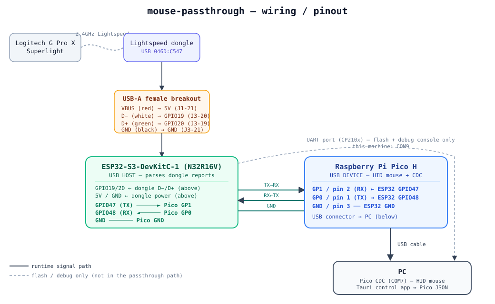

# Wiring / Pinout

Three physical links, all 3.3V logic, no level shifting needed:

1. **Dongle → ESP32** — USB-A female breakout wired to the DevKitC's native-USB
   header pins (GPIO19/20), plus 5V/GND to power the dongle.
2. **ESP32 ↔ Pico** — a 3-wire UART link (TX, RX, GND). This is the only link
   between the two boards.
3. **Pico → PC** — Pico's own USB connector (device port), the only USB cable
   that goes to the computer from this rig.

The ESP32's `UART` port and the Pico's USB port both also go to the PC, but
only for flashing/serial-console — they aren't part of the runtime signal path.

## Diagram



## ESP32-S3-DevKitC-1 (N32R16V) — USB host board

| ESP32 pin | Header | Connects to | Purpose |
|---|---|---|---|
| **GPIO19** | J3, pin 20 | USB-A breakout **D−** (white) | Native USB host, D− |
| **GPIO20** | J3, pin 19 | USB-A breakout **D+** (green) | Native USB host, D+ |
| **5V** | J1, pin 21 | USB-A breakout **VBUS** (red) | Powers the Lightspeed dongle |
| **GND** | J3, pin 21 | USB-A breakout **GND** (black) | Dongle ground |
| **GPIO47** | — | Pico **GP1** (physical pin 2) | UART0 TX → Pico RX (mouse frames) |
| **GPIO48** | — | Pico **GP0** (physical pin 1) | UART0 RX ← Pico TX (remap replies) |
| **GND** | — | Pico **GND** (physical pin 3) | Shared ground, UART link |
| GPIO38 | — | *(onboard, not wired)* | WS2812 RGB status LED |
| `UART` port | — | PC (USB cable) | Flashing + `Serial` debug console — **this machine: COM9** |
| `USB` port | — | *(left unplugged)* | Native USB is reserved for GPIO19/20 host wiring above |

> Keep the D+/D− pair short and equal length — it's an unshielded jumper run
> standing in for a real USB cable.

## Raspberry Pi Pico H — USB device board

| Pico pin | Physical pin | Connects to | Purpose |
|---|---|---|---|
| **GP1** | 2 | ESP32 **GPIO47** | UART0 RX ← mouse frames from ESP32 |
| **GP0** | 1 | ESP32 **GPIO48** | UART0 TX → remap/PC-cmd frames to ESP32 |
| **GND** | 3 | ESP32 **GND** | Shared ground, UART link |
| LED_BUILTIN (GP25) | — | *(onboard, not wired)* | Activity blink |
| USB connector | — | PC (USB cable) | The only cable that matters at runtime — presents as **"Logitech USB Receiver" (VID:PID 046D:C547)**, a composite HID mouse + CDC serial port — **this machine: COM7** |

## Quick reference: the 3-wire ESP32↔Pico link

```
ESP32 GPIO47 (TX)  ───────────►  Pico GP1 / pin 2 (RX)
ESP32 GPIO48 (RX)  ◄───────────  Pico GP0 / pin 1 (TX)
ESP32 GND          ───────────   Pico GND / pin 3
```

Baud: 1 Mbaud, `SERIAL_8N1`.

## COM ports (this machine — will differ on yours)

| Port | Board | Identity |
|---|---|---|
| COM9 | ESP32-S3 DevKitC-1 | Silicon Labs CP210x (10C4:EA60) — flash/console |
| COM7 | Pico H | 046D:C547 "Logitech USB Receiver" CDC |

Windows assigns a **new COM port whenever the Pico's VID:PID changes** (e.g.
after re-flashing from the TinyUSB default `239A:CAFE` to the cloned
`046D:C547` identity), so don't hardcode the Pico's port number anywhere —
the Tauri app auto-detects it by matching both IDs.
